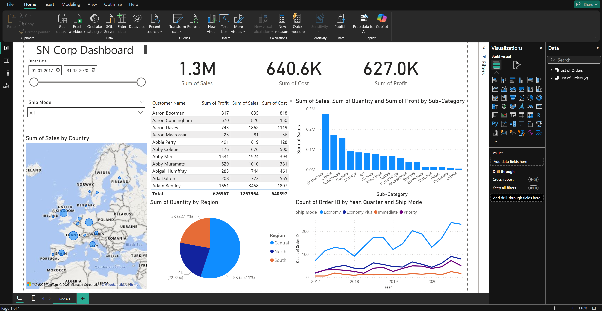
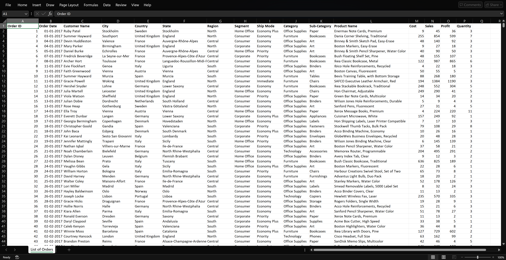

# Power BI Dashboard — Sales & Order Analytics

  



  

<p align="center">

  <strong>Interactive Business Intelligence Dashboard for Global Sales & Order Performance</strong>

</p>

  

<p align="center">

  

  

  

  

</p>

  

---

  

## 📌 Overview

  

**Sales & Order Analytics** is an interactive Microsoft Power BI dashboard developed to analyze global sales, profitability, order activity, customer behavior, product performance, and shipping operations.

  

The project demonstrates an end-to-end **Business Intelligence workflow**, starting with raw Excel data and progressing through data preparation, modeling, DAX-based metric development, visualization, and business analysis.

  

The dashboard is designed to transform raw transactional data into an interactive reporting environment that enables users to explore business performance across multiple dimensions.

  

---

  

## 🎯 Objectives

  

The primary objectives of this project are to:

  

- Analyze overall sales and profitability

- Monitor order volume and quantity

- Evaluate regional and country-level performance

- Analyze product category and sub-category performance

- Understand customer and segment behavior

- Analyze shipping modes

- Identify time-based sales and profit trends

- Provide interactive KPI-driven reporting

- Enable granular analysis through dynamic filtering and drill-downs

  

---

  

## 🗂️ Dataset

  

The project uses an Excel dataset containing transactional business information.

  

### Key Fields

  

| Field | Description |

|---|---|

| **Order ID** | Identifier for an order |

| **Date** | Order/transaction date |

| **Customer** | Customer associated with the order |

| **Product Category** | Product category |

| **Region** | Geographic region |

| **Segment** | Customer/business segment |

| **Shipping Mode** | Shipping method |

| **Cost** | Cost associated with the order |

| **Sales** | Sales amount |

| **Profit** | Profit generated |

| **Quantity** | Quantity ordered |

  



  

---

  

## 🔄 Data Preparation

  

The raw Excel dataset was processed using **Power Query** before being used for dashboard development.

  

### Data preparation included:

  

- Cleaning and transforming raw data

- Validating and assigning appropriate data types

- Structuring the dataset for analysis

- Preparing fields for reporting

- Maintaining data integrity

- Building a model optimized for interactive analysis

  

### Workflow

  

```text

Raw Excel Dataset

        ↓

Power Query

        ↓

Data Cleaning & Transformation

        ↓

Data Modeling

        ↓

DAX Measures

        ↓

Dashboard Development

        ↓

Business Analysis

```

  

---

  

## 🧩 Data Modeling

  

A structured Power BI data model was developed to support interactive analysis and filtering.

  

The dashboard enables analysis across multiple business dimensions:

  

```text

Geography

├── Region

└── Country

  

Products

├── Category

└── Sub-Category

  

Customers

└── Segment

  

Operations

└── Shipping Mode

  

Time

└── Date

```

  

The model was designed to support reusable DAX measures, dynamic filtering, drill-down analysis, and time-based reporting.

  

For additional details, see:

  

📄 [`Data_Model.md`](Documentation/Data_Model.md)

  

---

  

## 📐 DAX & Key Metrics

  

Custom DAX measures and calculated columns were developed for the dashboard's core KPIs.

  

### Core Metrics

  

- **Total Sales**

- **Total Profit**

- **Profit Margin**

- **Order Volume**

- **Average Sales per Order**

- **Total Quantity**

  

Time-based calculations were also implemented to support trend and comparative analysis.

  

Detailed calculations are documented in:

  

📄 [`DAX_Measures.md`](Documentation/DAX_Measures.md)

  

---

  

## 📊 Dashboard Features

  

The dashboard provides an interactive analytical experience through:

  

- 📌 KPI Cards

- 📊 Bar Charts

- 📈 Line Charts

- 🎛️ Interactive Slicers

- 🔎 Dynamic Filtering

- 🔽 Drill-down Analysis

- 📅 Time-based Analysis

  

### Interactive Dimensions

  

Users can explore performance by:

  

- Region

- Country

- Segment

- Category

- Sub-Category

- Shipping Mode

  

This allows users to move from high-level KPIs to more granular business analysis.

  

---

  

## 📈 Business Analysis

  

The dashboard supports analysis of several areas of business performance.

  

### 🌍 Regional Performance

  

Analyze differences in sales and profitability across geographic regions and countries.

  

### 📦 Product Performance

  

Evaluate product categories and sub-categories based on sales and profitability.

  

### 👥 Customer & Segment Analysis

  

Explore purchasing patterns and performance across customer segments.

  

### 🚚 Shipping Analysis

  

Analyze order activity and performance across different shipping modes.

  

### 📅 Time-Based Trends

  

Analyze changes in sales and profitability over time and identify seasonal patterns.

  

---

  

## 💡 Key Analytical Areas

  

The dashboard enables users to investigate:

  

- Top-performing regions

- Most profitable product categories

- Customer purchasing patterns

- Segment-level performance

- Seasonal sales trends

- Shipping efficiency patterns

- Changes in key business KPIs

  

> **Note:** These are analytical capabilities provided by the dashboard rather than fixed conclusions from the dataset. Results change dynamically based on the selected filters.

  

---

  

## 🛠️ Technology Stack

  

| Technology | Purpose |

|---|---|

| **Microsoft Power BI** | Dashboard development & visualization |

| **Power Query** | Data cleaning & transformation |

| **DAX** | KPI calculations & analytical measures |

| **Microsoft Excel** | Data source |

| **Data Modeling** | Analytical structure & relationships |

  

---

  

## 📁 Repository Structure

  

```text

power-bi-sales-order-analytics/

│

├── README.md

│

├── PowerBI/

│   └── Sales_Order_Analytics.pbix

│

├── Dataset/

│   └── Power_BI_Dataset.xlsx

│

├── Screenshots/

│   ├── Dashboard.png

│   └── Dataset.png

│

└── Documentation/

    ├── DAX_Measures.md

    ├── Data_Model.md

    └── Project_Documentation.md

```

  

---

  

## 📚 Documentation

  

| Document | Description |

|---|---|

| [`Project_Documentation.md`](Documentation/Project_Documentation.md) | Complete project methodology and workflow |

| [`DAX_Measures.md`](Documentation/DAX_Measures.md) | DAX measures and KPI calculations |

| [`Data_Model.md`](Documentation/Data_Model.md) | Data model and analytical structure |

  

---

  

## 🧠 Skills Demonstrated

  

This project demonstrates practical skills in:

  

- Business Intelligence

- Microsoft Power BI

- Power Query

- DAX

- Data Cleaning

- Data Transformation

- Data Modeling

- Data Visualization

- KPI Development

- Interactive Dashboard Development

- Sales Analytics

- Order Analytics

- Business Data Analysis

- Data Storytelling

  

---

  

## 🚀 Project Outcome

  

This project demonstrates the complete process of converting raw transactional data into an interactive Business Intelligence solution.

  

From **data ingestion and transformation** to **data modeling, DAX calculations, visualization, and analytical exploration**, the dashboard provides a structured way to understand sales and order performance.

  

---

  

## 📌 Project Status

  

**Completed**

  

The repository contains the Power BI dashboard, source dataset, dashboard screenshots, and supporting technical documentation.

  

---

  

## ⭐ Support

  

If you found this project useful or interesting, consider giving the repository a ⭐ on GitHub.

  

---

  

## 📄 License

  

This project is intended for educational and portfolio purposes.